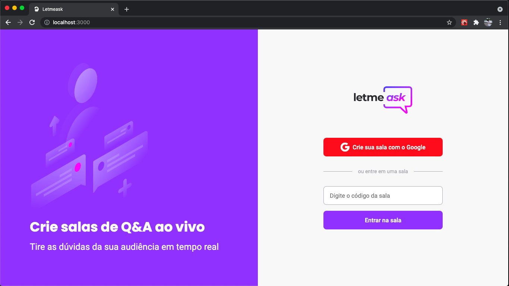
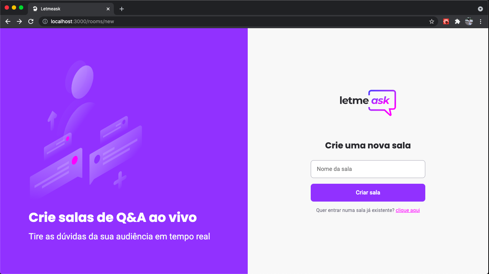
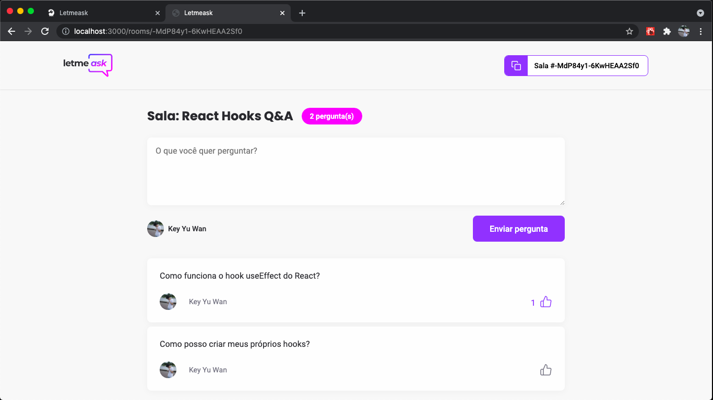
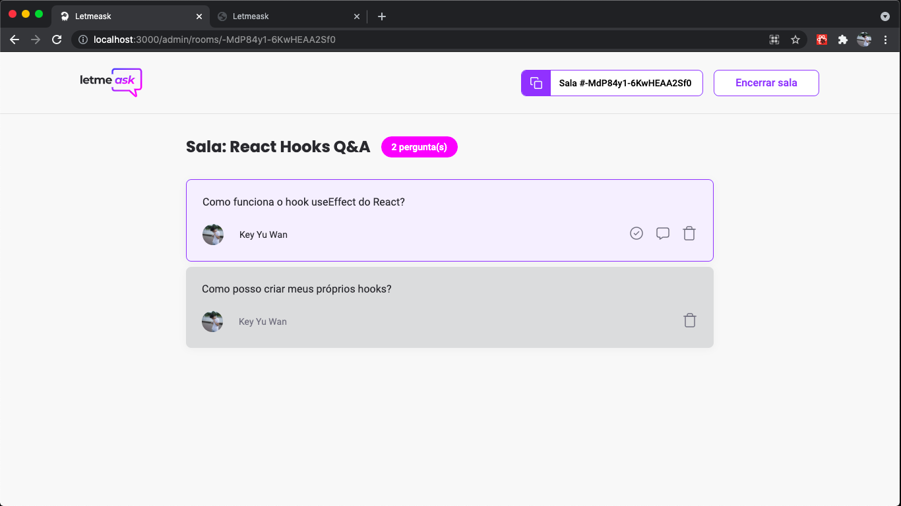

<div align="center">

</div>

<br>

# 📸 Overview

<div align="center">

</div>
<div align="center">

</div>
<div align="center">

</div>
<div align="center">

</div>

<br>

# 💻 Project

Esse projeto foi desenvolvido durante o evento <strong>NLW TOGETHER</strong> elaborado pela <strong>Rocketseat</strong>. <br><br>
O <strong>Letmeask</strong> é uma aplicação que ajuda pessoas a fazerem perguntas a alguém que estão assistindo (em lives por exemplo) e a essas pessoas que estão sendo assistidas a visualizarem as perguntas que vão responder, tendo a opção de marcar como lida, dar destaque e até excluir uma pergunta. Para as pessoas que estão perguntando, temos a opção de dar like nas perguntas. <br><br>
O fluxo da aplicação ocorre por meio de salas. Cada sala é única e terá um código, que pode ser copiado para mais pessoas entrarem na sala. O projeto também inclui sistema de autenticação com o Google.

<br>

# 🚀 Technologies

### Para o desenvolvimento dessa aplicação, foram utilizadas as seguintes tecnologias:

<br>

### ✔️ ReactJS

### ✔️ TypeScript

### ✔️ SCSS (SASS)

### ✔️ Firebase (Realtime Database)

<br>

# How to run

```
# Clone this repository
$ git clone https://github.com/keyyuwan/Letmeask

# Go to the directory
$ cd Letmeask

# Install Dependencies
$ yarn

# Run Web Server
$ yarn start
```
